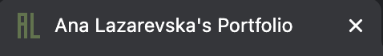
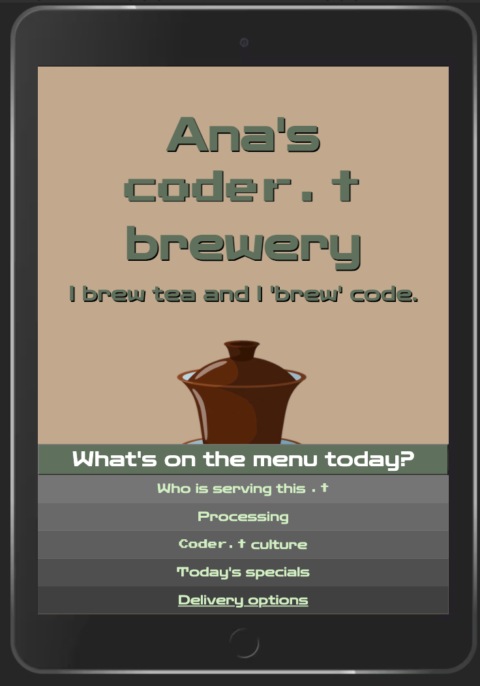

# Ana Lazarevska's Portfolio

My professional developer portfolio, containing About page, Projects page, Blog page, Skills page, and Contact page. It is short introduction about me, showing my coding skills. The portfolio will be updated regularly.

- [URL of the portfolio](https://ana-lazarevska-portfolio.netlify.app/)
- [GitHub repo of the portfolio](https://github.com/aplazarevska/my-portfolio)

---

## Table of contents

- [Description](##description)
- [Functionality/features](##functionality/features)
- [Sitemap](##sitemap)
- [Screenshots](##screenshots)
- [Target audience](##target-audience)
- [Tech stack](##tech-stack)

---

## Description

The inspiration for my portfolio comes from one of my interests - tea. I wanted to combine the theme of tea and the theme of coding together in an interesting way. 

I often use wordplay to show the double meaning in the titles and the subtitles of the webpages. Coder and .t are kind of synonyms that represent me as a person. I chose to refer to myself as 'coder.t', again merging the two themes (.t of course simply means tea). The navbar has the title 'What's on the menu today?' indicating both to a tea menu (with different categories relating to tea production and consumption) and navigation menu (with links to other pages). 

The background colour represents black tea with different amounts of milk in it (how do you like your tea?). The font colour is representative of green tea, or the tea lief. The main font I use is Zen Dots (to go with the theme of tea) and the words 'coder.t' are written with Press Start 2P, a pixelated font resembling the Terminal font (to go with the coding theme). 

The gaiwan (Chinese tea cup) tilts when one hovers/clicks on it. This is my subtle nod to the visitor who is viewing my portfolio, as well as kind of saying "cheers, enjoy". The gaiwan on the other pages is a home button. The prominent role that that item plays in the homepage is therefore with a purpose - to lead the visitor to remember that that item is the homepage, or leads to the homepage. 

The 'Who is serving this .t' category leads to the About page, and means that I am serving this .t, this tea, or this code, or this portfolio. 

The 'Processing' category leads to the Projects page. The idea is that as tea is processed and thus transformed into the dried leaves used for brewing, so the projects I have done show how I am transformed from total coding beginner, to a more seasoned professional. 

The 'Coder .t culture' category leads to the Blog page. Here over the time the blogs about tea culture will be replaced (or joined) by my own blogs about coding culture. 

The 'Today's specials' category refers to both specials that are found on a restaurant/tea house menu (the best that the chef/brewer has to offer), and to my specialities as a coder (the skills that I possess.)

And finally the 'Delivery options' category leads to the Contact page. Again, the double meaning is in play. Delivery of tea, or delivery of any product for that matter, delivery of my skills, delivery of my services, can be achieved by reaching out to me. 

---

## Functionality/features

- The code for all the webpages is written in separate css and html files to allow easier browsing through it.
- Use of semantic tags for better understanding of the function of the code.
- There are comments on the HTML and the CSS to structure the code in meaningful blocks.
- Media queries are used to cater for different viewport sizes. 
- Hover pseudo-class is used to change the state of some elements when the mouse points over them. 
- Navbar is present on all the pages to allow fast navigation around the portfolio. 
- The home button is in a prominent position at the front of the header (title and subtitle).
- The image in the About page is in gif format, to add playfulness. 
- The resume opens in a separate window and can be downloaded. 
- The images of the projects on the Projects page open in a separate window and can be zoomed in. 
- The links on the contact page lead straight to my professional accounts, and the email opens in a Compose window pre-filled with my email address. 
- The images include the alt attribute to allow better accessibility.
- SRI is implemented for security.

---

## Sitemap

The homepage has a navbar as a footer which leads to the five subpages. The five subpages have the same navbar which leads to every one of them. Each subpage has home button that leads to the homepage. 

There is a link to my resume on the About page. There are two images for each of the three projects on the Projects page, each of which opens in new window. Five blog posts have link to the original articles. And the Contact page has three links to other platforms where I am present. 

---

## Screenshots

- The window tab has my initials in the colour used throughout the website. 

- The homepage view on desktop.

  

- The navbar on iPad.

  

- The About page on desktop.

  

- The About page on iPhone, showing the link to my resume.

  

- The resume opened in separate window. 

  

- The Projects page on desktop.

  

- The Blog page on desktop.

  

- The Read on... button on each blog leads to external website.

  

- The Skills page on iPhone.

  

- The Contact page on iPad.

  

- Clicking on the Gmail icon opens the Compose mail window. 

  

---

## Target audience

The audience I'm trying to reach with my portfolio are the employers, my educators, as well as my peers. 

---

## Tech stack

My portfolio is created and deployed with:

- HTML
- CSS
- Netlify